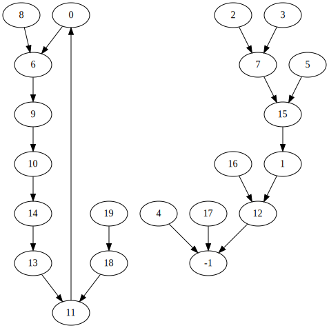
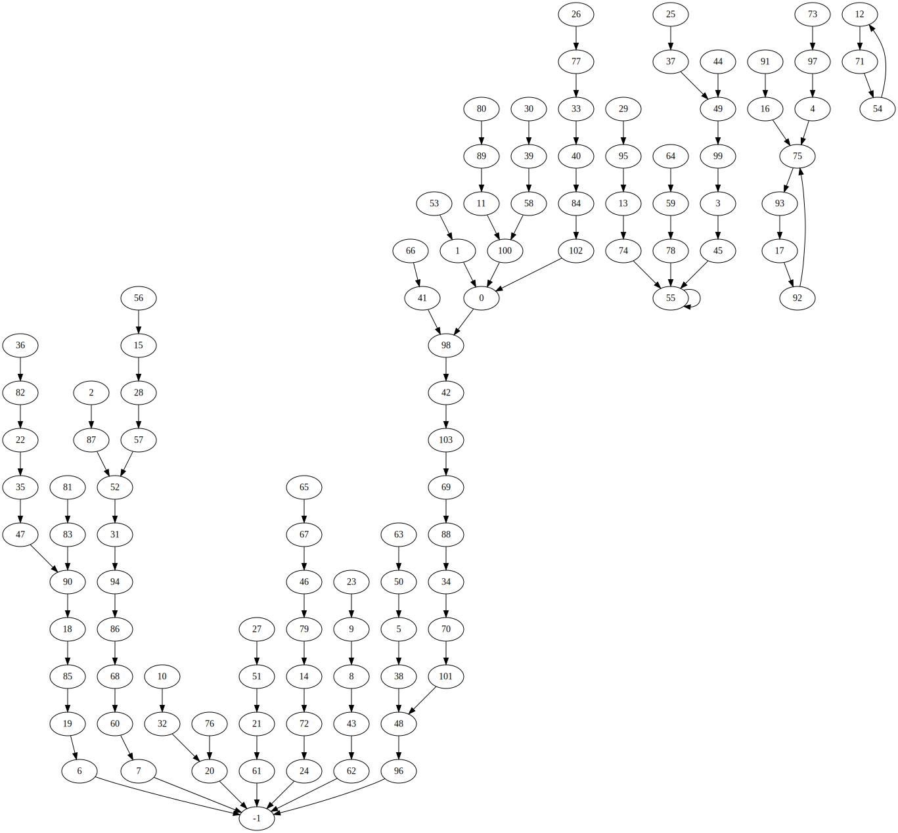
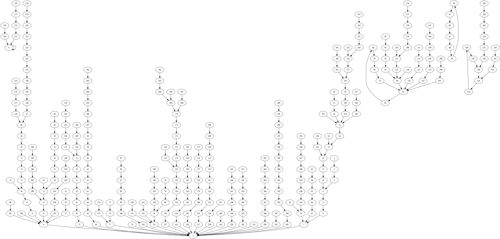

# fatsim

starter code for assignment 5

## `test1.txt`


```
$ cat test1.txt
  6 12  7  7 -1 15  9 15  6 10
 14  0 -1 11 13  1 12 -1 11 18

$ ./fatsim < test1.txt
chain sizes: 1 1 5
elapsed time: 0.000s
```

## `test2.txt`


```
$ cat test2.txt
1 2 3 4 5 6 7 -1
7 6 5 4 3 2 1 0
0 1 2 0 4 4 6 7
0 1 2 3 4 5 6 7

$ ./fatsim < test2.txt
chain sizes: 9
elapsed time: 0.000s
```

## `test3.txt`
Too long to show the file, nor the graph.
```
$ ./fatsim < test3.txt
chain sizes:
elapsed time: 0.038s
```

## `test4.txt`

```
cat test4.txt
  98    0   87   45   75   38   -1   -1   43    8
  32  100   71   74   72   28   75   92   85    6
  -1   61   35    9   -1   37   77   51   57   95
  39   94   20   40   70   47   82   49   48   58
  84   98  103   62   49   55   79   90   96   99
   5   21   31    1   12   55   15   52  100   78
   7   -1   -1   50   59   67   41   46   60   88
 101   54   24   97   55   93   20   33   55   14
  89   83   22   90  102   19   68   52   34   11
  18   16   75   17   86   13   -1    4   42    3
   0   48    0   69

$ ./fatsim < test4.txt
chain sizes: 3 4 5 7 10 11 17
elapsed time: 0.000s
```
## `test5.txt`


```
$ ./fatsim < test5.txt
chain sizes: 1 1 2 2 3 3 6 6 6 7 7 8 8 10 12 12 15 15 20 21
elapsed time: 0.000s
```
## `test6.txt`

```
$ ./fatsim < test6.txt
chain sizes: 2 5 11 13 15 22 22 27 37 53 55 78 81 102 120 125 125 126 126 167 171
  178 183 192 198 203 207 215 254 272
elapsed time: 0.002s
```
## `test7.txt`

```
$ ./fatsim < test7.txt
chain sizes: 597 828 1007 1504 2386 2513 2569 3093 3201 3421 3862 4395 5126 6590 8145
  8512 9035 9042 9163 9802 10861 11009 11394 11452 11942 13039 14064 16556 16812 17197
  18635 18747 20666 26324 26499
elapsed time: 0.265s
```

## using `gen.py`
```
$ ./gen.py 10000000 33 | ./fatsim
chain sizes: 22562 22929 40123 58711 61844 68366 84036 86491 92003 95352 97758 113158
  116995 125994 128294 152189 153320 162697 169201 169266 184034 187839 198301 215629
  276541 289916
elapsed time: 3.460s
```
